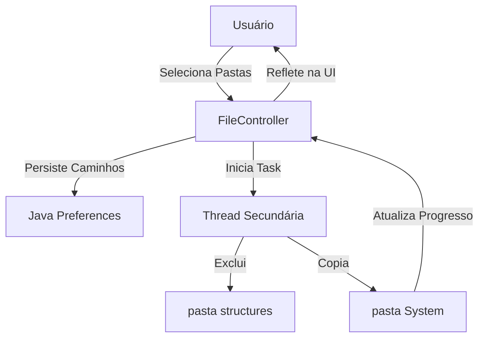

# 🔄 Promob Version Manager 

**Gerencie e alterne entre diferentes versões do Promob de forma instantânea e automatizada.**  
*Desenvolvido em Java 11 com JavaFX e interface moderna AtlantaFX.*

---

## 🟢 Status do Projeto
> **MVP Concluído** 🚀  
> O projeto está funcional e pronto para uso em ambientes de desenvolvimento e produção local para agilizar o setup de versões.

---

## 🏗️ Arquitetura / Visão Técnica
A aplicação foi construída seguindo o padrão **MVC (Model-View-Controller)** para desacoplamento da lógica de interface e operações de IO.

- **Frontend**: JavaFX com FXML para definição de layouts.
- **Estilização**: CSS moderno utilizando a biblioteca **AtlantaFX** para um visual "Premium" e suporte a temas.
- **Gerenciamento de Arquivos**: Utiliza a API `java.nio.file` para caminhada em árvore (`FileTree`) permitindo cópias e deleções recursivas eficientes.
- **Multithreading**: Implementação de `javafx.concurrent.Task` para garantir que a interface permaneça responsiva durante operações pesadas de IO.
- **Persistência**: Uso de `java.util.prefs.Preferences` para memorizar os últimos caminhos selecionados pelo usuário.



---

## 🛠️ Stack Técnica
- **Linguagem:** Java 11
- **Framework UI:** JavaFX 13
- **Tema:** AtlantaFX (Nord Light/Dark)
- **Ícones:** Ikonli (Material Design 2)
- **Build Tool:** Maven
- **Gerenciamento de Dependências:** Maven Central

---

## ✨ Funcionalidades Principais
- [x] **Seleção de Origem:** Define a pasta raiz onde estão armazenadas todas as versões do sistema.
- [x] **Seleção de Destino:** Identifica automaticamente a pasta de instalação do Promob.
- [x] **Listagem Dinâmica:** Detecta e lista subpastas de versão em tempo real.
- [x] **Limpeza Inteligente:** Remove a pasta `structures` no destino antes da cópia para evitar conflitos de cache/versão.
- [x] **Cópia de Alta Performance:** Substitui os arquivos de sistema de forma recursiva.
- [x] **Dark Mode:** Alternância entre tema claro e escuro com um clique.
- [x] **Feedback Visual:** Barra de progresso e status em tempo real durante a operação.

---

## 🖥️ Interface e Uso
Como se trata de uma aplicação Desktop, não possui endpoints REST. A interação é feita via formulário intuitivo:

1. **Configuração de Caminhos**: Selecione uma vez e a aplicação lembrará na próxima vez.
2. **Escolha da Versão**: Selecione no dropdown a versão desejada.
3. **Execução**: Clique em "Trocar Versão" e acompanhe a barra de progresso.

---

## 🚀 Como rodar localmente

### Pré-requisitos
- **JDK 11** ou superior instalado.
- **Maven 3.6+** configurado no PATH.

### Passos
1. Clone o repositório:
   ```bash
   git clone https://github.com/seu-usuario/TrocarVersaoPromob.git
   ```
2. Entre no diretório do projeto:
   ```bash
   cd TrocarVersaoPromob/change-version
   ```
3. Execute via Maven:
   ```bash
   mvn clean javafx:run
   ```

---

## ⚙️ Configurações / Variáveis de Ambiente
O projeto não utiliza arquivos `.env`. As configurações de diretórios são armazenadas no registro do usuário (Windows Registry via `java.util.prefs`), garantindo que seus caminhos locais sejam mantidos sem necessidade de re-configuração manual.

---

## 🔒 Segurança
- **Local Only:** A aplicação não realiza requisições externas, operando 100% offline.
- **File System:** Requer permissões de escrita nas pastas selecionadas (Origem e Destino).
- **Sem Dependências Críticas:** Focada em bibliotecas de UI e utilitários padrão Java.

---

## 📂 Estrutura do Projeto
```text
change-version/
├── src/
│   ├── main/
│   │   ├── java/com/betolara1/
│   │   │   ├── App.java           # Entry point e gestão de temas
│   │   │   └── FileController.java # Lógica principal e IO
│   │   └── resources/com/betolara1/
│   │       ├── primary.fxml       # Layout da interface
│   │       └── style.css          # Customizações visuais
└── pom.xml                        # Configurações Maven
```

---

## 🎯 Próximos Passos
- [ ] Implementar sistema de logs em arquivo para auditoria de falhas.
- [ ] Adicionar botão para "Abrir Pasta de Destino" após a conclusão.
- [ ] Criar instalador executável (.exe) usando `jpackage`.
- [ ] Opção de Backup Automático da versão atual antes da substituição.

---

## 📸 Screenshots / Visual
*(Para recrutadores: Esta aplicação utiliza a biblioteca AtlantaFX para entregar uma experiência de usuário moderna e profissional, fugindo do visual padrão do Windows 95 frequentemente associado ao Java Desktop.)*

> [!TIP]
> **Dica de Design:** Ao rodar a aplicação, experimente alternar para o Dark Mode para ver a adaptação completa da paleta de cores.

---
**Desenvolvido por Roberto Lara.**  
*Transformando fluxos manuais em automações elegantes.*
